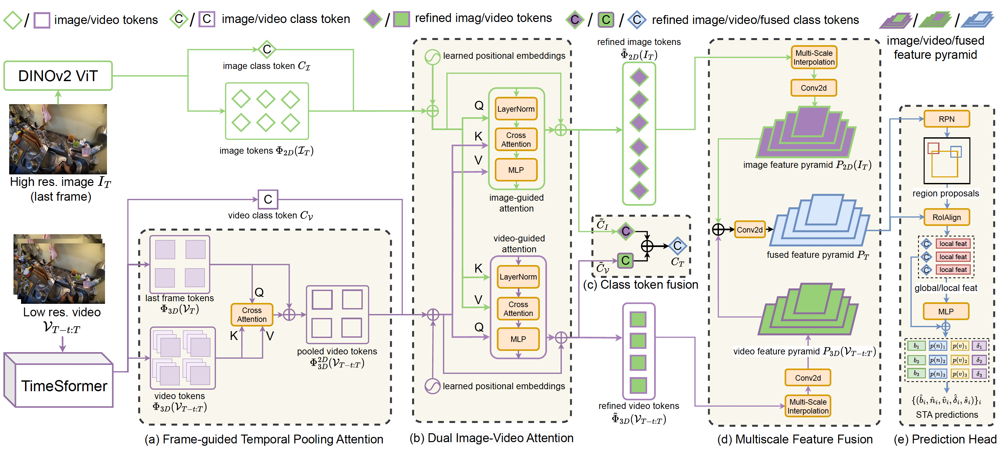
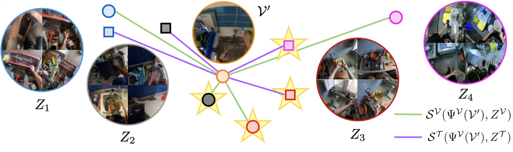
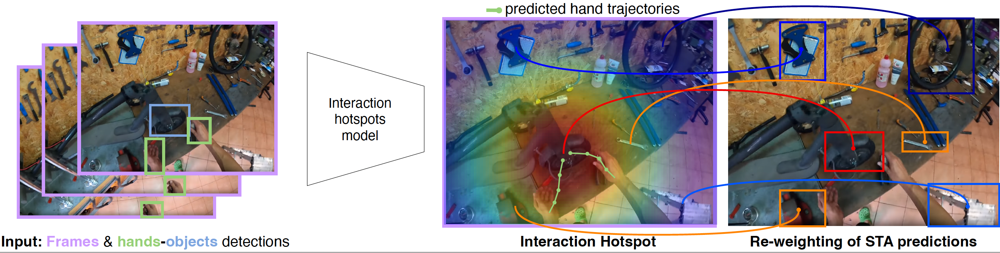

# AFFttention
Official repository of "AFF-ttention! Affordances and Attention models for Short-Term Object Interaction Anticipation".
We win the 2nd 🥈 place at the Ego4D Short Term Anticipation Challenge at CVPR 24'

## STAformer 🤖
Our model processes a low-resolution video and a high-resolution image with a novel attention-based backbone, STAformer. 
* STAformer extracts DINOv2 features from the still image 📷 and TimeSformer features from the video 🎥.
* The novel Frame-Guided Temporal Pooling Attention projects the video features on the last-frame reference.
* The Dual Image-Video Cross-Attention refines both modalities
* We apply a multi-scale fusion
* We adapt the Fast-RCNN head to our STA task.

## Environment affordances as a persistent memory 🧠💭🧠

We first leverage environment affordances, estimated by matching the input observation to a learned affordance database, to predict probability distributions over nouns and verbs, which are used to refine verb and noun probabilities predicted by STAformer. Our intuition is that linking a zone across similar environments captures a description of the feasible interactions, grounding predictions into previously observed human behavior

## Interaction hotspots 

The interaction hotspots relate STA predictions to a spatial prior of where an interaction may take place in the current frame. This is done by predicting an interaction hotspot, which is used to re-weigh confidence scores of STA predictions depending on the object’s locations.

